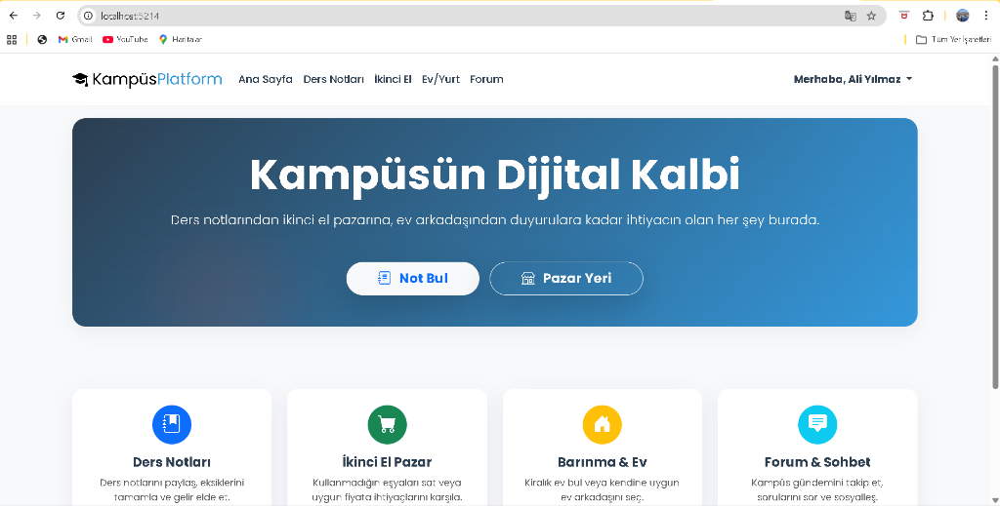
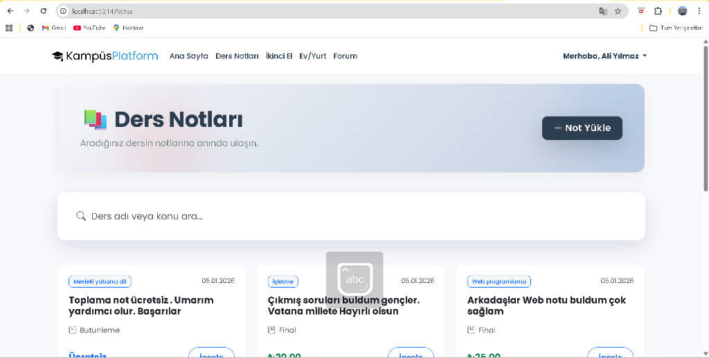
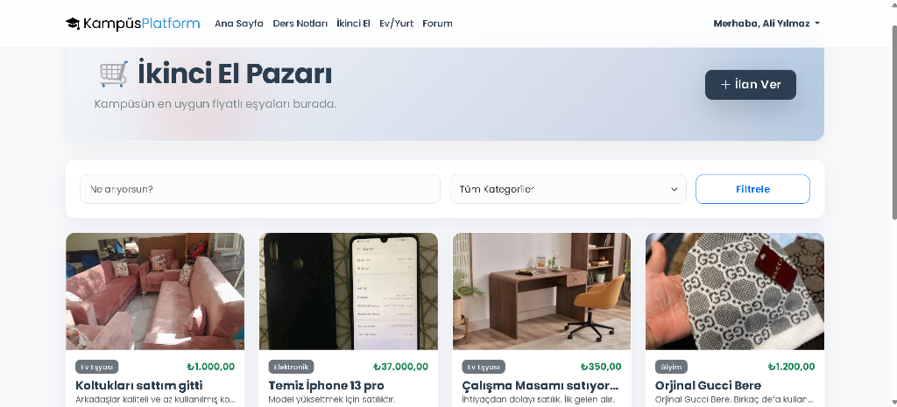
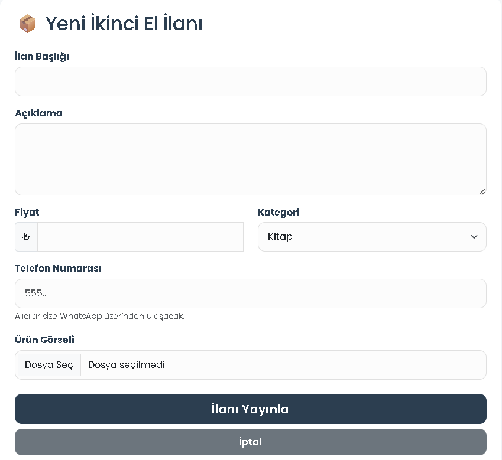
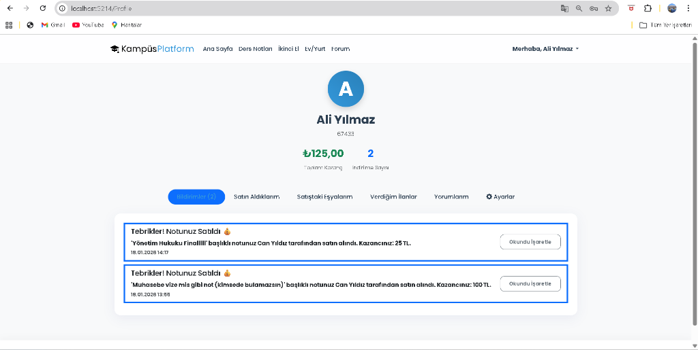

# 🎓 Üniversite Platformu (EduCore Academy)

Modern ve dinamik bir üniversite ekosistemi için tasarlanmış, öğrencilerin akademik ve sosyal ihtiyaçlarını tek bir noktadan yönetebilecekleri kapsamlı bir web platformu.

## 📺 Proje Tanıtım Videosu
Projenin özelliklerini ve kullanıcı arayüzünü detaylı izlemek için:
[**YouTube Proje Tanıtımı**](https://youtu.be/nbWLbuKvELw)

---

## 📸 Ekran Görüntüleri

  
  

  
  

  

---

## 🚀 Öne Çıkan Özellikler

### 📚 Akademik ve Bilgi Paylaşımı
*   **Ders Notları Sistemi:** Bölüm ve ders bazlı not paylaşımı. PDF ve görsel içerik desteği.
*   **Duyurular:** Fakülte ve kampüs genelindeki güncel bilgilerden anında haberdar olun.
*   **Profil Yönetimi:** Kişisel akademik ilerlemenizi ve paylaşımlarınızı takip edin.

### 🏘️ Sosyal Yaşam ve Yardımlaşma
*   **Öğrenci Forumu:** Akademik konularda tartışma, soru sorma ve yardımlaşma alanı.
*   **İkinci El Pazarı:** Kampüs içi güvenli alışveriş (kitap, eşya, teknoloji).
*   **Konaklama İlanları:** Ev arkadaşı arama ve kiralık yer ilanları için merkezi platform.

### 🔐 Güvenlik ve Roller
*   **Rol Tabanlı Erişim:** Admin ve Öğrenci rolleri için özelleştirilmiş dashboardlar.
*   **Kimlik Doğrulama:** ASP.NET Core Identity ile güvenli kayıt ve giriş sistemi.

---

## 🛠️ Teknoloji Yığını

*   **Framework:** .NET 8.0 (ASP.NET Core MVC)
*   **Veritabanı:** SQLite
*   **ORM:** Entity Framework Core
*   **Frontend:** HTML5, CSS3, JavaScript
*   **Tasarım:** Modern Glassmorphism, Responsive Arayüz

---

## 📂 Veritabanı Yapısı
Proje, proaktif veri yönetimi için aşağıdaki tabloları içeren `universite_platform_v2.db` dosyasını kullanır:
*   `ForumTopics`: Sosyal etkileşimler
*   `HousingAds`: Konaklama ilanları
*   `LectureNotes`: Akademik içerikler
*   `MarketItems`: Satılık ilanları
*   `AspNetUsers`: Güvenli kullanıcı verisi

---

## 📄 Lisans
Bu proje eğitim amaçlı geliştirilmiştir. Tüm hakları saklıdır.
